# cicd-pipeline

### Description
GitHub repo (NodeJs app):
- `main`
- `dev`

Pipeline:
- Multibranch Jenkins pipeline with auto triggers for deploying an application: `CICD`
- Regular Jenkins pipeline with manual triggers for deploying an application: `CD_deploy_manual`

Installed Jenkins plugins: 
- Docker Pipeline
- Docker plugin
- Git plugin
- Groovy
- NodeJs plugin
- Pipeline

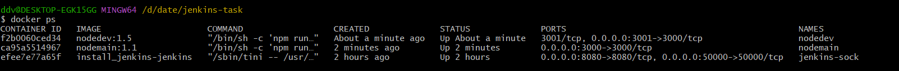
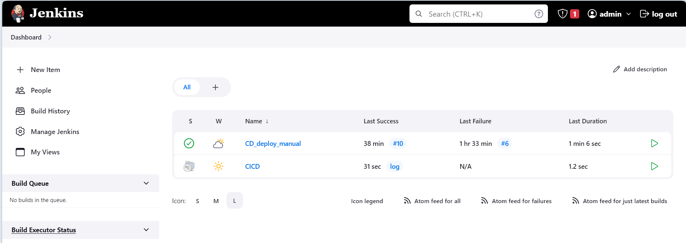

#### Multibranch Jenkins pipeline settings
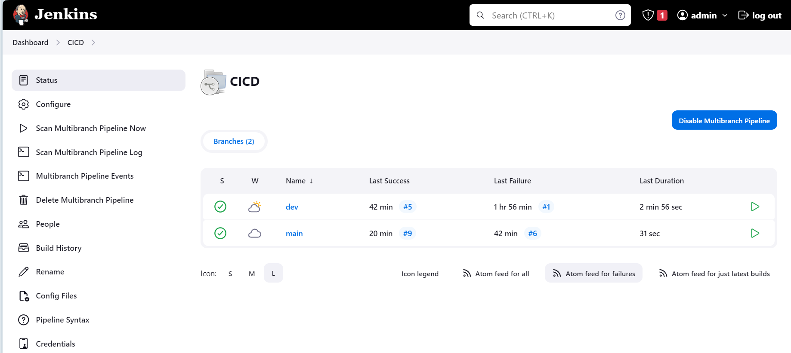
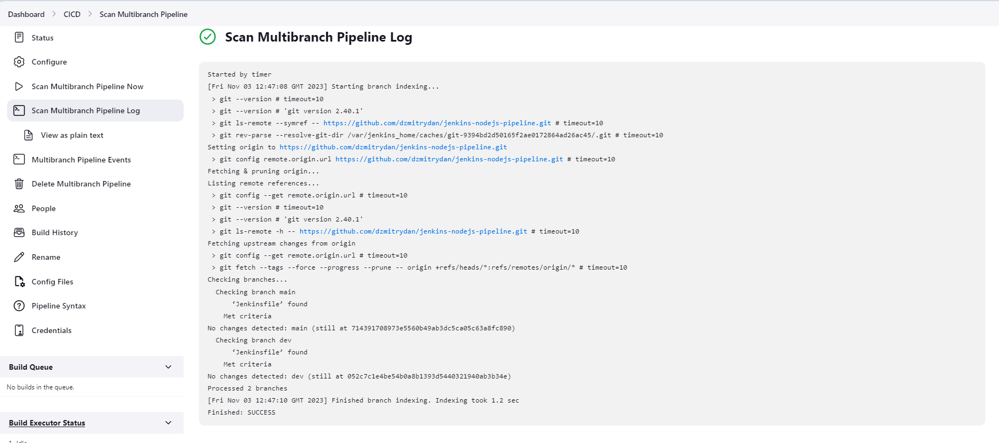
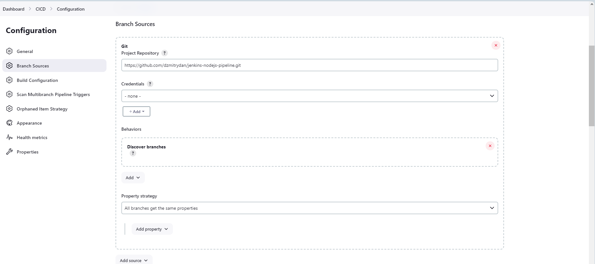
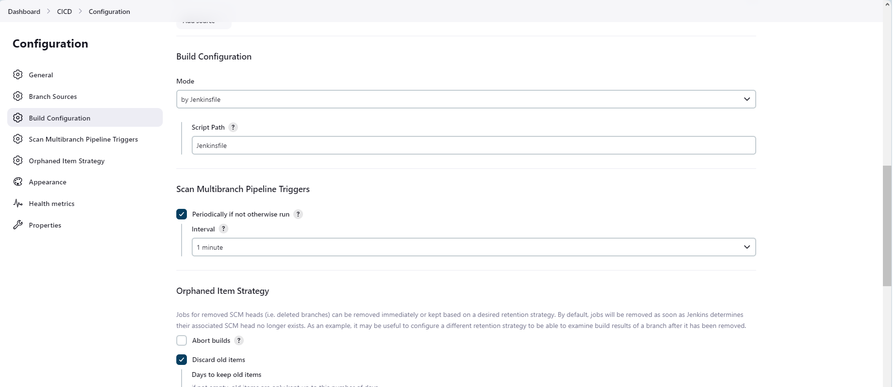
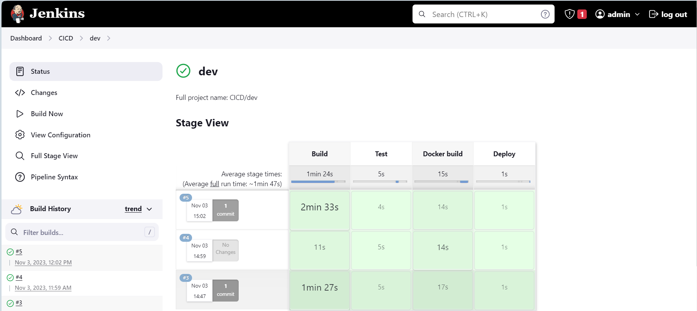
[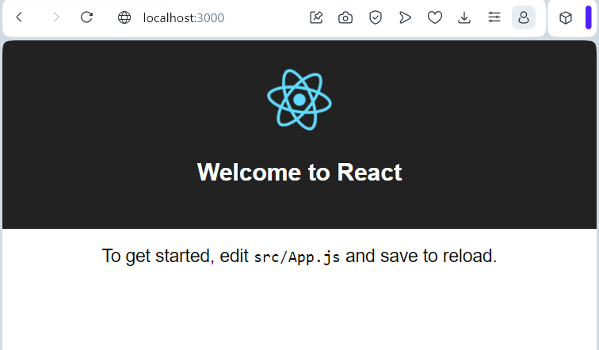](readme-assets/web-1.png.png)

#### Regular Jenkins pipeline setting
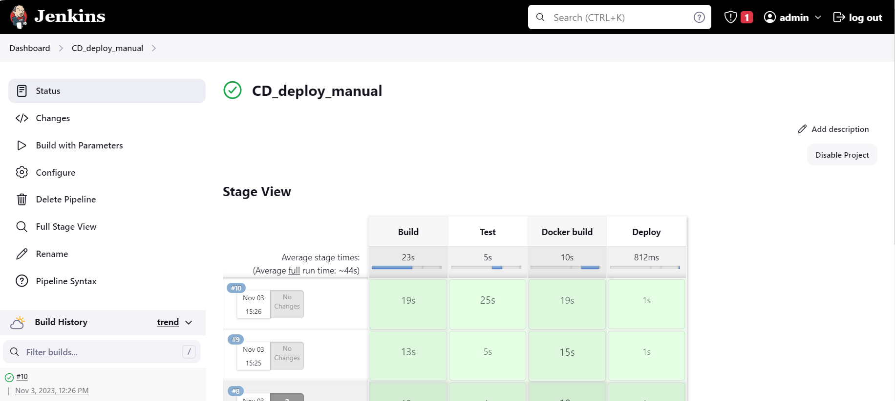
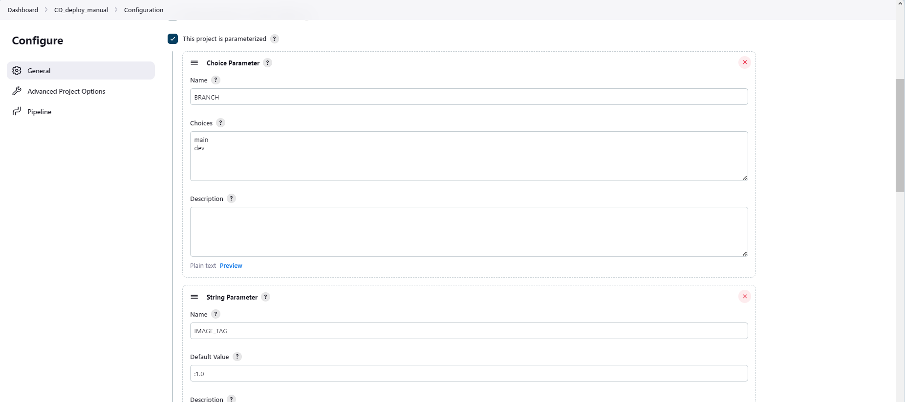
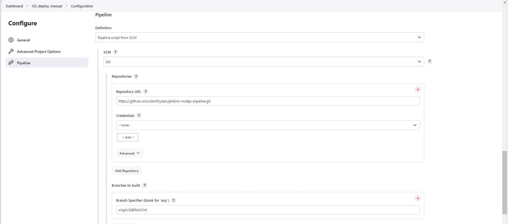
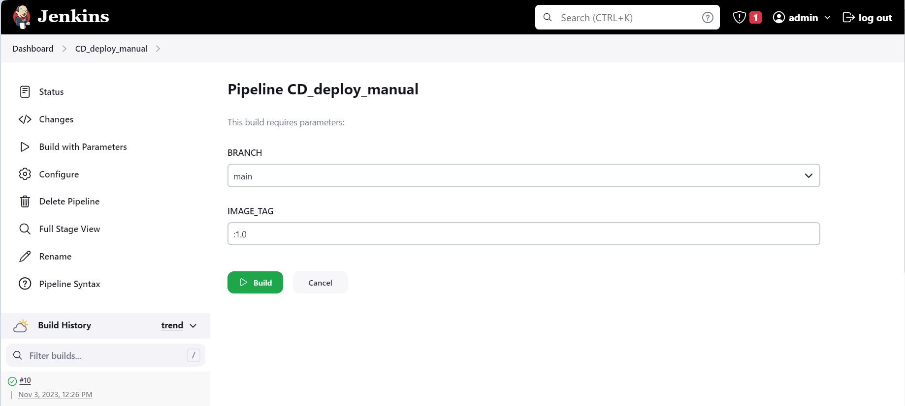
[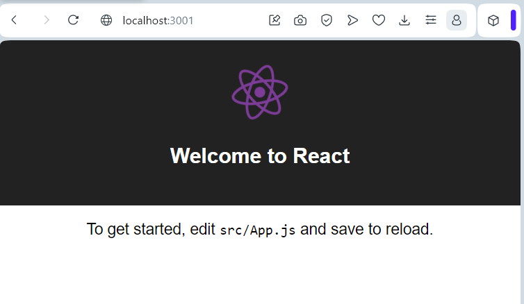](readme-assets/web-2.png.png)
